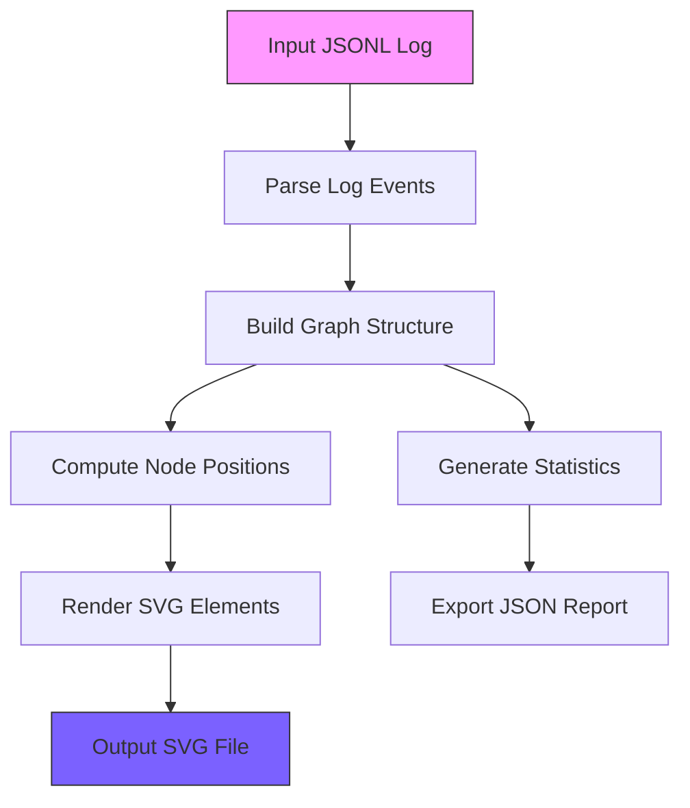

# Prompt-Graph – Visualize RAG Retrieval Paths as SVG

> *Made autonomously using [NEO](https://heyneo.so) · [](https://marketplace.visualstudio.com/items?itemName=NeoResearchInc.heyneo)*

[](https://www.python.org/downloads/)
[](https://opensource.org/licenses/MIT)
[]()

## Quickstart

```python
from prompt_graph_visuali.visualize import visualize_rag_log

# Generate an SVG visualization from RAG retrieval logs
visualize_rag_log(
    input_path="logs/retrieval.jsonl",  # JSONL file with retrieval events
    output_path="output/retrieval_graph.svg",  # Output SVG file
    title="My RAG Retrieval Path",  # Optional graph title
    layout="spring"  # Layout algorithm (spring, shell, circular)
)
```

## Example Output

Here's a sample SVG output showing a RAG retrieval path with 5 chunks:

```xml
<?xml version="1.0" encoding="utf-8"?>
<svg xmlns="http://www.w3.org/2000/svg" width="1200" height="800">
  <!-- Graph content showing: -->
  <text x="600" y="28">RAG Retrieval Graph · "What is Retrieval Augmented Generation..."</text>
  <text x="600" y="48">5 chunks · 8 connections</text>
  <!-- Query node (purple) -->
  <circle cx="709.2" cy="220.3" r="54" fill="none" stroke="#7B61FF"/>
  <!-- Chunk nodes (blue) with score-based coloring -->
  <circle cx="322.4" cy="132.4" r="40" fill="#00B4D8" stroke="#3FB950"/>
  <!-- Connections with weights -->
  <line x1="667.2" y1="233.2" x2="173.5" y2="385.0" stroke="#6C757D"/>
  <text x="420.3" y="304.1">0.95</text>
</svg>
```

## Pipeline Architecture



> Turn opaque RAG logs into inspectable SVG graphs locally, zero API keys.

## The Problem  
RAG (Retrieval-Augmented Generation) systems often operate as black boxes, making it difficult for developers to debug or optimize retrieval paths. Existing tools lack a way to visually trace which chunks were retrieved and how they connect, leaving developers to rely on verbose logs or manual inspection of embeddings. This opacity slows down debugging, fine-tuning, and understanding of RAG workflows.

## Who it's for  
This tool is for developers building or debugging RAG systems who need a clear, visual representation of retrieval paths. For example, a developer fine-tuning a RAG pipeline for a chatbot might use this to identify why irrelevant chunks are being retrieved and adjust their embedding strategy accordingly.

## Install

```bash
git clone https://github.com/dakshjain-1616/prompt-graph
cd prompt-graph
pip install -r requirements.txt
```

## Key features

- **100% Local Execution:** No data leaves your machine; no API keys or cloud accounts required.
- **RAG-Specific Semantics:** Nodes colored by similarity scores, edges encode chunk relationships.
- **Vector Output:** Generates crisp SVG files that scale infinitely for reports or debugging.
- **Single File Simplicity:** Entire pipeline runs via one script with minimal dependencies.

## Run tests

```bash
pytest tests/ -q
# 71 passed
```

## Project structure

```
prompt-graph/
├── prompt_graph_visuali/  ← main library
├── tests/                 ← test suite
├── scripts/               ← demo scripts
├── examples/              ← usage examples
└── requirements.txt
```

## Python source files
### prompt_graph_visuali/visualize.py
```python
#!/usr/bin/env python3
"""
Prompt-Graph: Visualize RAG retrieval paths as SVG graphs.
Parses RAG log files and outputs a retrieval_graph.svg showing
which chunks were retrieved and how they connect.

New in v2:
  - Mock/dry-run mode (no log file needed)
  - JSON stats report export
  - Graph diff between two log files
  - Cluster detection + color-coding
  - Score threshold env vars
  - --export-report, --mock, --diff, --cluster CLI flags
"""

import argparse
import datetime
import json
import math
import os
import random
import statistics
import sys
from pathlib import Path
from typing import Any

import networkx as nx
import svgwrite
from rich.console import Console
from rich.panel import Panel
from rich.table import Table
from rich import box as rich_box

VERSION = "2.0.0"

_console = Console()         # stdout — success / info
_err = Console(stderr=True)  # stderr — warnings / errors

# ── Configuration via environment variables ──────────────────────────────────
OUTPUT_DIR = os.getenv("OUTPUT_DIR", "outputs")
DEFAULT_SVG_WIDTH = int(os.getenv("SVG_WIDTH", "1200"))
DEFAULT_SVG_HEIGHT = int(os.getenv("SVG_HEIGHT", "800"))
NODE_RADIUS = int(os.getenv("NODE_RADIUS", "40"))
FONT_FAMILY = os.getenv("FONT_FAMILY", "monospace")
COLOR_QUERY = os.getenv("COLOR_QUERY", "#7B61FF")
COLOR_CHUNK = os.getenv("COLOR_CHUNK", "#00B4D8")
COLOR_SECONDARY = os.getenv("COLOR_SECONDARY", "#48CAE4")
COLOR_EDGE = os.getenv("COLOR_EDGE", "#ADB5BD")
COLOR_EDGE_STRONG = os.getenv("COLOR_EDGE_STRONG", "#6C757D")
COLOR_BG = os.getenv("COLOR_BG", "#0D1117")
COLOR_TEXT = os.getenv("COLOR_TEXT", "#E6EDF3")
COLOR_SCORE_HIGH = os.getenv("COLOR_SCORE_HIGH", "#3FB950")
COLOR_SCORE_MED = os.getenv("COLOR_SCORE_MED", "#D29922")
COLOR_SCORE_LOW = os.getenv("COLOR_SCORE_LOW", "#F85149")
LAYOUT_ALGO = os.getenv("LAYOUT_ALGO", "spring")
LAYOUT_SEED = int(os.getenv("LAYOUT_SEED", "42"))
GITHUB_REPO = os.getenv("GITHUB_REPO", "github.com/dakshjain-1616/prompt-graph")

# Score thresholds (configurable so teams can tune to their scoring model)
SCORE_HIGH_THRESHOLD = float(os.getenv("SCORE_HIGH_THRESHOLD", "0.75"))
SCORE_MED_THRESHOLD = float(os.getenv("SCORE_MED_THRESHOLD", "0.50"))

# Cluster color palette — cycled for graphs with >8 clusters
_CLUSTER_COLORS = [
    "#FF6B6B", "#4ECDC4", "#45B7D1", "#96CEB4",
    "#FFEAA7", "#DDA0DD", "#F0A04B", "#A29BFE",
]

# Diff annotation colors
_DIFF_COLORS = {
    "added":     "#39D353",  # bright green ring
    "removed":   "#F85149",  # red ring
    "changed":   "#E3B341",  # amber ring
    "unchanged": None,       # no special ring
}


# ── Log Parsing ──────────────────────────────────────────────────────────────

def parse_log_file(log_path: str) -> dict[str, Any]:
    """
    Parse a RAG log file and extract graph data.

    Supports two formats:
      1. JSONL (one JSON object per line) — structured events
      2. Plain text  — heuristic extraction of chunk IDs and scores

    JSONL event types:
      {"event": "query",    "query": "...", "timestamp": "..."}
      {"event": "retrieve", "chunk_id": "c1", "score": 0.95,
                            "content": "...", "source": "doc.txt"}
      {"event": "connect",  "from": "c1", "to": "c2", "weight": 0.7}
      {"event": "rerank",   "chunk_id": "c1", "rank": 1}
    """
    path = Path(log_path)
    if not path.exists():
        raise FileNotFoundError(
            f"Log file not found: {log_path}\n"
            f"  Tip: run with --mock to generate a synthetic graph without a log file."
        )

    raw = path.read_text(encoding="utf-8")
    lines = [l.strip() for l in raw.splitlines() if l.strip()]

    query_text = ""
    nodes: dict[str, dict] = {}   # chunk_id → attrs
    edges: list[dict] = []
    reranks: dict[str, int] = {}
    parse_errors = 0

    jsonl_count = sum(1 for l in lines if l.startswith("{"))
    use_jsonl = jsonl_count >= len(lines) * 0.5

    if use_jsonl:
        for line in lines:
            try:
                obj = json.loads(line)
            e
```

### tests/test_visualize.py
```python
"""
Tests for Prompt-Graph (visualize.py).

Requirements covered:
  1. Input: RAG log file → Output: SVG graph
  2. Input: 10 chunks    → Output: 10 nodes in graph
  3. Input: Local file   → Output: 0 network calls (no socket activity)
  4. Mock mode           → SVG without any log file
  5. Stats report        → JSON export with correct schema
  6. Graph diff          → diff_logs detects added/removed/changed nodes
  7. Cluster detection   → cluster IDs assigned to chunk nodes
  8. Score thresholds    → SCORE_HIGH_THRESHOLD / SCORE_MED_THRESHOLD respected
"""

import json
import os
import sys
import tempfile
from pathlib import Path
from unittest import mock

import pytest

# Ensure project root is importable
sys.path.insert(0, str(Path(__file__).parent.parent))

from prompt_graph_visuali import (
    build_graph,
    compute_layout,
    compute_stats,
    diff_logs,
    export_report,
    make_mock_data,
    parse_log_file,
    render_svg,
    visualize,
    visualize_diff,
    visualize_mock,
)

# ── Helpers ──────────────────────────────────────────────────────────────────

def _make_jsonl_log(tmp_path: Path,
                    n_chunks: int = 5,
                    n_connections: int = 2,
                    query: str = "What is RAG?",
                    filename: str = "test.log") -> Path:
    """Write a synthetic JSONL RAG log and return its path."""
    events = [{"event": "query", "query": query}]
    for i in range(1, n_chunks + 1):
        events.append({
            "event": "retrieve",
            "chunk_id": f"chunk_{i:03d}",
            "score": round(0.5 + i / (n_chunks * 2), 3),
            "content": f"Content of chunk {i}",
            "source": f"doc{i}.txt",
        })
    for i in range(n_connections):
        events.append({
            "event": "connect",
            "from": f"chunk_{i+1:03d}",
            "to": f"chunk_{i+2:03d}",
            "weight": 0.7,
        })
    log_path = tmp_path / filename
    log_path.write_text("\n".join(json.dumps(e) for e in events))
    return log_path


def _make_plain_log(tmp_path: Path, n_chunks: int = 3) -> Path:
    """Write a plain-text RAG log."""
    lines = ["Query: Explain vector search"]
    for i in range(1, n_chunks + 1):
        lines.append(f"chunk_{i:03d} score={0.5 + i*0.1:.2f} source=wiki.md content here")
    log_path = tmp_path / "plain.log"
    log_path.write_text("\n".join(lines))
    return log_path


# ── Test 1: RAG log → SVG file ───────────────────────────────────────────────

class TestLogToSVG:
    def test_svg_file_is_created(self, tmp_path):
        log = _make_jsonl_log(tmp_path)
        out = tmp_path / "out.svg"
        result = visualize(str(log), output_path=str(out))
        assert result == str(out)
        assert out.exists(), "SVG file must be created"

    def test_svg_has_correct_extension(self, tmp_path):
        log = _make_jsonl_log(tmp_path)
        out = tmp_path / "graph.svg"
        visualize(str(log), output_path=str(out))
        assert out.suffix == ".svg"

    def test_svg_is_non_empty(self, tmp_path):
        log = _make_jsonl_log(tmp_path)
        out = tmp_path / "out.svg"
        visualize(str(log), output_path=str(out))
        assert out.stat().st_size > 0, "SVG file must not be empty"

    def test_svg_contains_xml_declaration_or_svg_tag(self, tmp_path):
        log = _make_jsonl_log(tmp_path)
        out = tmp_path / "out.svg"
        visualize(str(log), output_path=str(out))
        content = out.read_text()
        assert "<svg" in content, "Output must contain an SVG element"

    def test_svg_contains_query_text(self, tmp_path):
        log = _make_jsonl_log(tmp_path, query="TestQueryString")
        out = tmp_path / "out.svg"
        visualize(str(log), output_path=str(out))
        content = out.read_text()
        assert "TestQueryString" in content

    def test_svg_title_customisable(self, tmp_path):
        log = _make_jsonl_log(tmp_path)
        out = tmp_path / "out.svg"
        visualize(str(
```

### scripts/demo.py
```python
#!/usr/bin/env python3
"""
demo.py — Prompt-Graph demonstration script.

Generates sample RAG logs and produces SVG visualizations in outputs/.
Runs completely offline with no API keys required.

Demos:
  1. Basic 5-chunk retrieval (spring layout)
  2. Large 10-chunk retrieval (shell layout)
  3. Hybrid retrieval (circular layout)
  4. Mock/dry-run mode — no log file needed
  5. Graph diff — compare two retrieval runs
  6. Cluster detection — community color-coding
  7. Stats report export — JSON alongside SVG
"""

import json
import os
import random
import sys
from pathlib import Path

sys.path.insert(0, str(Path(__file__).parent))

from rich.console import Console
from rich.panel import Panel
from rich.progress import (
    BarColumn,
    MofNCompleteColumn,
    Progress,
    SpinnerColumn,
    TextColumn,
    TimeElapsedColumn,
)
from rich.rule import Rule
from rich.table import Table
from rich import box as rich_box

from prompt_graph_visuali import (
    VERSION,
    build_graph,
    compute_stats,
    export_report,
    diff_logs,
    make_mock_data,
    parse_log_file,
    render_svg,
    visualize,
    visualize_diff,
    visualize_mock,
    compute_layout,
)

OUTPUT_DIR = Path(os.getenv("OUTPUT_DIR", "outputs"))
LAYOUT_SEED = int(os.getenv("LAYOUT_SEED", "42"))

console = Console()

# ── Sample data generators ───────────────────────────────────────────────────

SAMPLE_QUERIES = [
    "What is Retrieval Augmented Generation and how does it differ from fine-tuning?",
    "How does vector similarity search work in embeddings space?",
    "Explain the trade-offs between BM25 and dense retrieval methods.",
]

SAMPLE_SOURCES = [
    "papers/attention_is_all_you_need.pdf",
    "docs/rag_survey_2023.pdf",
    "wiki/vector_databases.md",
    "blog/retrieval_strategies.md",
    "docs/embedding_models.md",
    "papers/dense_passage_retrieval.pdf",
    "docs/bm25_explained.md",
    "wiki/knn_search.md",
    "papers/fusion_retrieval.pdf",
    "docs/re-ranking_guide.md",
]

SAMPLE_CONTENTS = [
    "RAG combines parametric memory (model weights) with non-parametric memory (retrieved docs).",
    "Dense retrieval uses bi-encoder models to embed queries and passages into shared vector space.",
    "BM25 is a bag-of-words retrieval function that ranks documents based on term frequency.",
    "Cross-encoders re-rank retrieved candidates by jointly encoding query and passage.",
    "Vector similarity is typically measured via cosine distance or dot-product.",
    "Chunking strategies include fixed-size, sentence-based, and semantic chunking.",
    "Hybrid retrieval combines sparse (BM25) and dense (embedding) scores via RRF.",
    "The retrieval step selects the top-k most relevant passages from a knowledge base.",
    "Embeddings from contrastive training outperform generative embeddings on retrieval tasks.",
    "Multi-hop retrieval iteratively queries to gather evidence across multiple documents