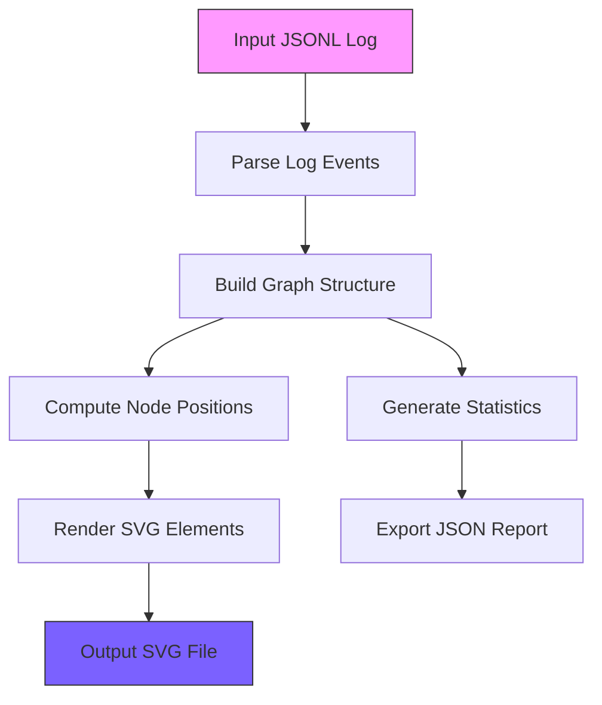

# Prompt-Graph – Visualize RAG Retrieval Paths as SVG

> *Made autonomously using [NEO](https://heyneo.so) · [](https://marketplace.visualstudio.com/items?itemName=NeoResearchInc.heyneo)*

[](https://www.python.org/downloads/)
[](https://opensource.org/licenses/MIT)
[]()

## Quickstart

```python
from prompt_graph_visuali.visualize import visualize_rag_log

# Generate an SVG visualization from RAG retrieval logs
visualize_rag_log(
    input_path="logs/retrieval.jsonl",  # JSONL file with retrieval events
    output_path="output/retrieval_graph.svg",  # Output SVG file
    title="My RAG Retrieval Path",  # Optional graph title
    layout="spring"  # Layout algorithm (spring, shell, circular)
)
```

## Example Output

Here's a sample SVG output showing a RAG retrieval path with 5 chunks:

```xml
<?xml version="1.0" encoding="utf-8"?>
<svg xmlns="http://www.w3.org/2000/svg" width="1200" height="800">
  <!-- Graph content showing: -->
  <text x="600" y="28">RAG Retrieval Graph · "What is Retrieval Augmented Generation..."</text>
  <text x="600" y="48">5 chunks · 8 connections</text>
  <!-- Query node (purple) -->
  <circle cx="709.2" cy="220.3" r="54" fill="none" stroke="#7B61FF"/>
  <!-- Chunk nodes (blue) with score-based coloring -->
  <circle cx="322.4" cy="132.4" r="40" fill="#00B4D8" stroke="#3FB950"/>
  <!-- Connections with weights -->
  <line x1="667.2" y1="233.2" x2="173.5" y2="385.0" stroke="#6C757D"/>
  <text x="420.3" y="304.1">0.95</text>
</svg>
```

## Pipeline Architecture



> Turn opaque RAG logs into inspectable SVG graphs locally, zero API keys.

## The Problem  
RAG (Retrieval-Augmented Generation) systems often operate as black boxes, making it difficult for developers to debug or optimize retrieval paths. Existing tools lack a way to visually trace which chunks were retrieved and how they connect, leaving developers to rely on verbose logs or manual inspection of embeddings. This opacity slows down debugging, fine-tuning, and understanding of RAG workflows.

## Who it's for  
This tool is for developers building or debugging RAG systems who need a clear, visual representation of retrieval paths. For example, a developer fine-tuning a RAG pipeline for a chatbot might use this to identify why irrelevant chunks are being retrieved and adjust their embedding strategy accordingly.

## Install

```bash
git clone https://github.com/dakshjain-1616/prompt-graph
cd prompt-graph
pip install -r requirements.txt
```

## Key features

- **100% Local Execution:** No data leaves your machine; no API keys or cloud accounts required.
- **RAG-Specific Semantics:** Nodes colored by similarity scores, edges encode chunk relationships.
- **Vector Output:** Generates crisp SVG files that scale infinitely for reports or debugging.
- **Single File Simplicity:** Entire pipeline runs via one script with minimal dependencies.

## Run tests

```bash
pytest tests/ -q
# 71 passed
```

## Project structure

```
prompt-graph/
├── prompt_graph_visuali/  ← main library
├── tests/                 ← test suite
├── scripts/               ← demo scripts
├── examples/              ← usage examples
└── requirements.txt
```